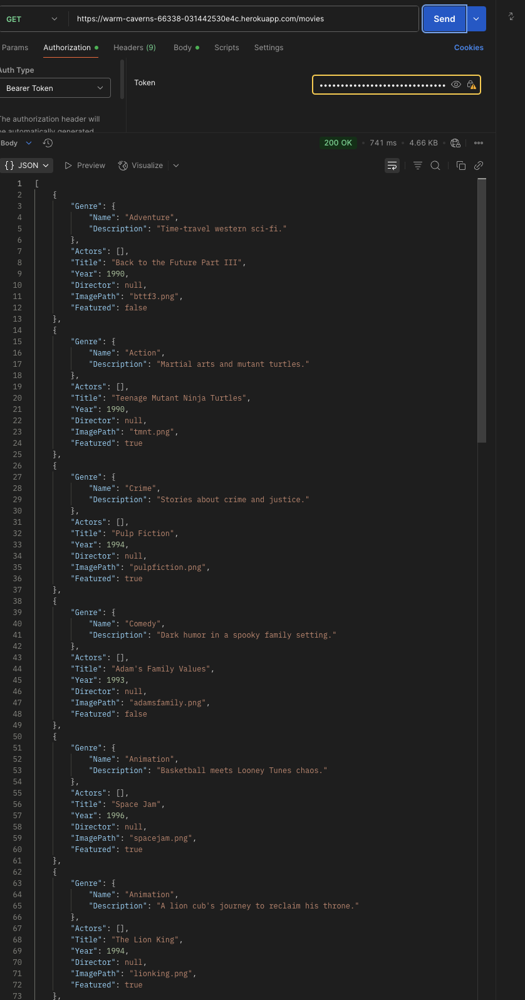

# 🎬 Roy's 90s Movie API

A RESTful API built with Node.js and Express that serves data about 90s movies. It allows users to register, log in, update their info, and access a list of curated movies from the greatest decade in film.

---

## 🚀 Live App

🔗 [Deployed on Heroku](https://warm-caverns-66338-031442530e4c.herokuapp.com/)

---

## 📂 Features

- User registration and login with JWT authentication
- Secure password hashing using bcrypt
- Fully RESTful endpoints (GET, POST, PUT, DELETE)
- Data validation with express-validator
- Hosted on MongoDB Atlas with Mongoose models
- CORS enabled for universal access

---

## 🛠️ Technologies Used

- Node.js
- Express.js
- MongoDB Atlas
- Mongoose
- bcrypt
- JWT (jsonwebtoken)
- express-validator
- Postman (for testing)
- Heroku (deployment)

---

  
📸 API Test Screenshots (click to expand)

## 📸 Screenshots

### 📝 1. User Registration

Registers a new user with hashed password and validated input.

---

### 🔐 2. User Login

Logs in an existing user and returns a valid JWT token.

---

### ⭐ 3. Add Favorite Movie

Adds a movie to the user's list of favorites.

---

### ❌ 4. Delete Favorite Movie

Removes a movie from the user's favorites list.

---

### 🛠️ 5. Update User

Updates user information (email, password, etc.).

### 🗑️ 6. Delete User

Deletes the user account from the database.

---

### 🎬 7. Get All Movies

Fetches the full list of 90s movies (requires auth token).

---

## 📚 API Endpoints

| Method | Endpoint           | Description                            |
| ------ | ------------------ | -------------------------------------- |
| POST   | `/users`           | Register new user                      |
| POST   | `/login`           | Log in and get token                   |
| GET    | `/movies`          | Get list of all movies (auth required) |
| GET    | `/movies/:title`   | Get a single movie by title            |
| PUT    | `/users/:username` | Update user info                       |
| DELETE | `/users/:username` | Delete user                            |

---

## ✅ To Do

- Add test coverage
- Build front-end UI

---

## 🧠 Reflection

This project taught me how to structure an Express API, implement secure authentication, and deploy to Heroku with environment variables. If I could go back, I'd add more automated testing and CI/CD workflows. Overall, it gave me confidence to build more full-stack applications in the future.
